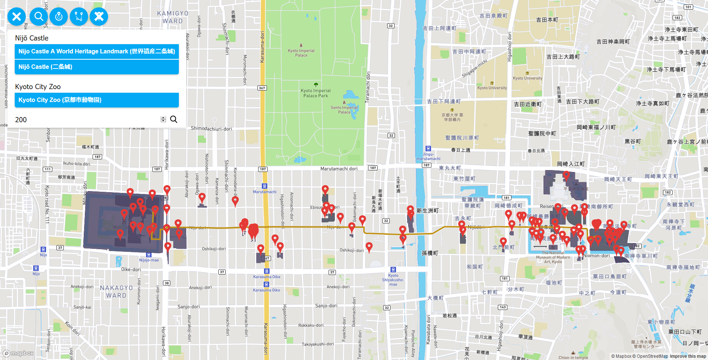

# Overview

This application shows spots interesting for tourists in Kyoto. These spots are defined as having some type of content in keys `tourism` or `leisure` or having `amenity='place_of_worship'`. Most important features are:
- search by name/keyword with autocomplete
- find nearby tourist spots in a selected distance
- find the shortest path between two locations selected by name and show tourist spots around this path in selected distance

This is it in action:



The application has 2 separate parts, the client which is a [frontend web application](#frontend) using MapBox API and mapbox-gl.js and the [backend application](#backend) based on the NodeJS web framework [ExpressJS](https://expressjs.com/). Geo data is stored in PostgreSQL database using PostGIS. Routing is accomplished by using pgRouting. The frontend application communicates with backend using a [REST API](#api).

# Frontend

The frontend application is a static HTML page (`/public/views/index.html`), which shows a MapBox map. As it is displaying locations inside a city the standard Mapbox Streets style is used.

All relevant frontend code is in `/public/js/main.js` which is bundled using [Browserify](http://browserify.org/) into `/public/js/bundle.js` that is included in `index.html`. The responsibilities of the frontend code are:
- controlling the user interaction with menu buttons
- displaying autocomplete suggestions under the appropriate text box
- displaying geo features by overlaying the map with a geojson layer and markers. The geojson is provided directly by backend APIs

# Backend

The backend application is written using ExpressJS and is responsible for querying the database and formatting its responses for the frontend.

## Data

Kyoto data is coming directly from Open Street Maps. I downloaded the whole Kyoto area (around 220MB) and imported it using `osm2pgsql` into the standard OSM schema in WGS 84. The routing database was created using `osm2pgrouting` into the standard pgRouting schema. 

## Funcionality

All backend code is in `/app.js`. Geojsons returned by APIs are generated by using a standard `st_asgeojson` function, however some postprocessing is necessary. I made a simple `GeoJson class` that has all the necessary properites of a well formed GeoJson. After recieving results from the query these geojsons are collected into a `FeatureCollection` geojson.

Autocomplete suggestions and search are using the fulltext search capabilities of PostgreSQL. I created a search configuartion `jp` that is a copy of the `simple` configuration with the only change being unaccenting the words. The function `to_tsvector('jp', "name:en")` is used to create the tsvector to search in and `to_tsquery('jp', 'zoo')` is used to search. Suggestions are made using the prefix syntax `zo:*` that is applied on every word in the query. For example if I search for `kyo c zoo` the query will be transformed to `kyo:* & c:* & zoo:*` which will find `Kyoto City Zoo`.

## Api

**Get autocomplete suggestions when trying to search**

`GET /suggest?q=zo`

**Find a tourist spot using an incomplete name/keyword**

`GET /search?q=hotel&f=0`

**Find a tourist spot using its exact name**

`GET /search?q=Kyoto City Zoo&f=1`

**Find tourist spots around a location at a selected distance**

`GET /nearby?q=Kyoto City Zoo&d=500`

**Find the shortest path between two locations selected by name and show interesting spots around this path at a selected distance**

`GET /between?start=Nijō Castle&end=Kyoto City Zoo&d=200`

### Response

API calls `/search` and `/nearby` return a response in the form of a well formed geojson of type `FeatureCollection`. API call `/between` returns a json response in the form of an array where the first element is a geojson of the path found between the two locations and the second a `FeatureCollection` geojson with the features found around this path. API call `/suggest` returns a json that contains an array of suggested location names:
```
[
  {
    "name": "京都市動物園",
    "name:en": "Kyoto City Zoo"
  },
  {
    "name": "重要文化財 経蔵",
    "name:en": "Important Cultural Property Kyo-zo"
  }
]
```